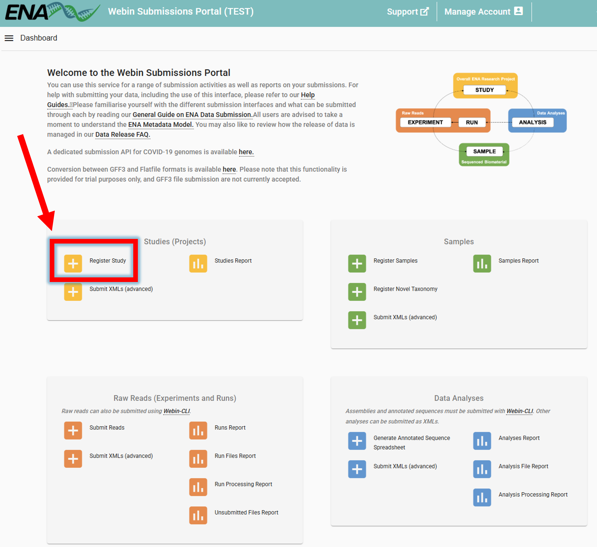
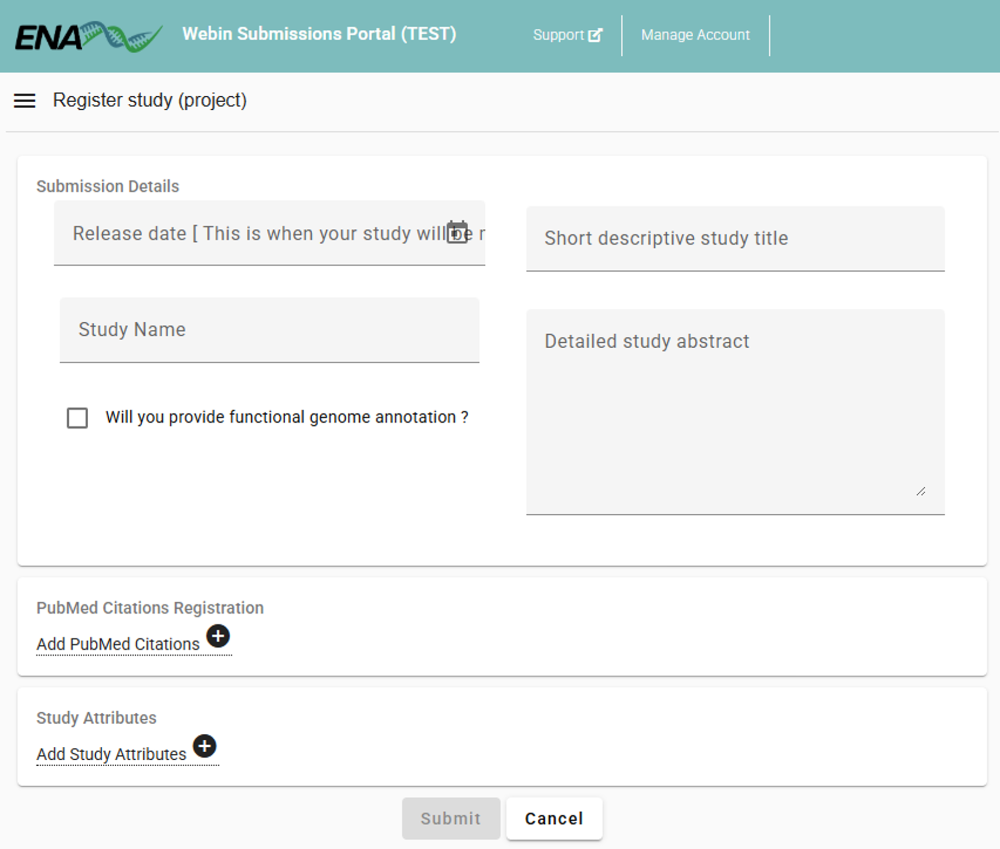
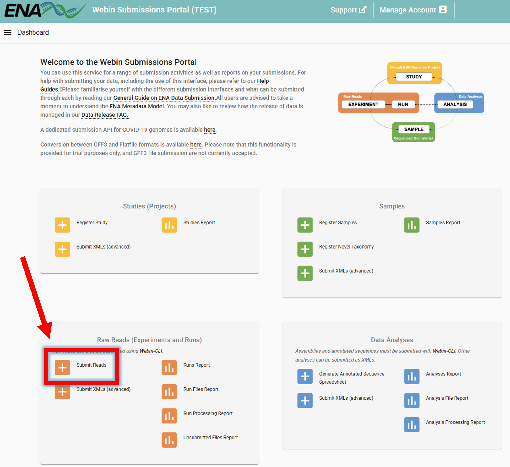
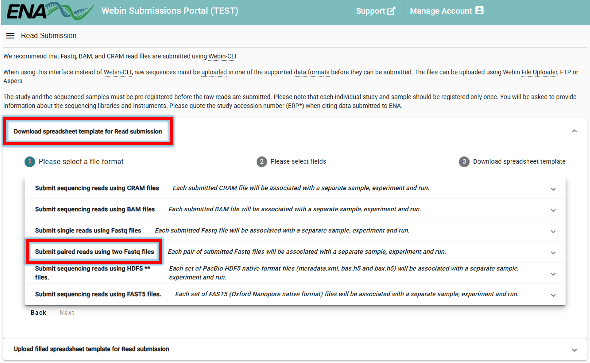
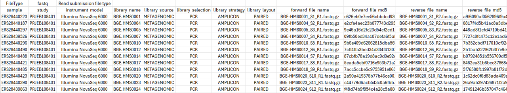
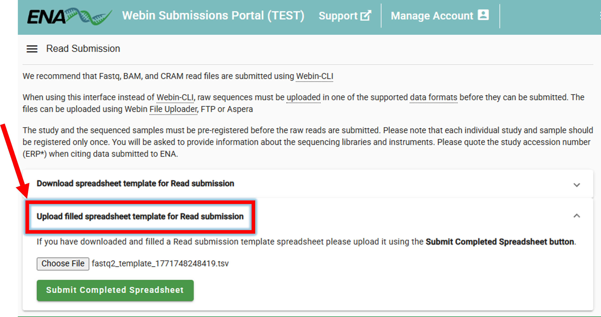
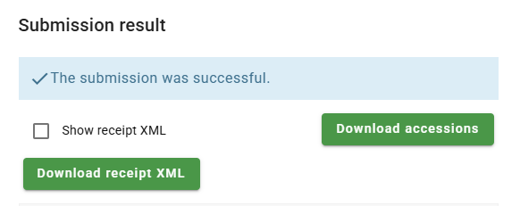
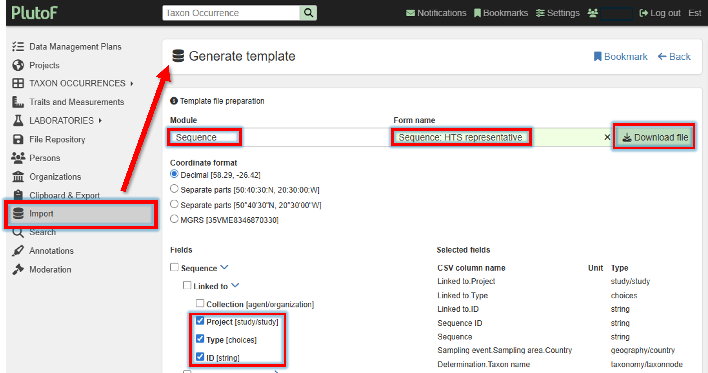

.. |logo_BGE_alpha| image:: _static/logo_BGE_alpha.png
  :width: 300
  :alt: Alternative text
  :target: https://biodiversitygenomics.eu/

.. |eufund| image:: _static/eu_co-funded.png
  :width: 200
  :alt: Alternative text

.. |chfund| image:: _static/ch-logo-200x50.png
  :width: 210
  :alt: Alternative text

.. |ukrifund| image:: _static/ukri-logo-200x59.png
  :width: 150
  :alt: Alternative text

.. |logo_BGE_small| image:: _static/logo_BGE_alpha.png
  :width: 120
  :alt: Alternative text
  :target: https://biodiversitygenomics.eu/

.. raw:: html

    

.. role:: red

|logo_BGE_alpha|

Data sharing
************

Data sharing ... 

Uploading sample records to ENA
===============================

`ENA (European Nucleotide Archive) <https://www.ebi.ac.uk/ena/browser/home>`_ 
is an internationally recognized public repository for nucleotide 
sequence data and associated sample metadata, 
ensuring your data is **findable, accessible, and reusable**.

If the data is already registered in `PlutoF <https://plutof.ut.ee/en>`_ , it can be uploaded to ENA using the **Publishing Lab** in PlutoF
(see section :ref:`registering_samples_in_plutof`).

.. note::
  
  If the data is not registered in PlutoF, 
  it can be uploaded to ENA manually (see `ENA documentation <https://ena-docs.readthedocs.io/en/latest/submit/samples.html>`_).
  When submitting metabarcoding data from environmental samples, then ``tax_id`` value is **256318**; and ``scientific_name`` is **metagenome**.

Using the **Publishing Lab** in PlutoF, 
users can submit sample records 
to the ENA database. 
The PlutoF platform acts as a broker for ENA, 
utilising its programmatic Webin submission 
service for sample data submission. 
The resulting ENA and BioSamples identifiers 
are stored in PlutoF alongside the original sample records.

Publishing is project-based: all samples within a 
selected study are submitted together, and the dataset 
can be updated later by re-publishing.

.. figure:: _static/plutof/to_ENA.png
  :width: 650
  :align: center

*To publish your dataset in ENA, go to Main menu -> Laboratories -> Publishing Lab -> ENA Datasets -> New*

**Steps to publish:**

| **1.** Select the project name from the autocomplete list (project **moderator rights** are required).
| **2.** Fill in any missing mandatory field values as required by ENA.
| **3.** Save the dataset.
| **4.** After administrator approval, publish the dataset to ENA.

.. note::
  
  Samples uploaded to ENA are treated as independent samples (BioSamples) - 
  that is, they are not linked to a BioProject. 
  **Samples will be linked to a BioProject when the raw sequence data is associated 
  with the samples.**
  See 'Uploading raw sequence data to ENA' below.

___________________________________________________

Uploading raw sequence data to ENA
==================================

When the samples are uploaded to ENA through the PlutoF platform, the raw sequence data can be linked to them. 
For that, first a **BioProject** needs to be created (:ref:`Register a study <register_study>`), 
followed by the :ref:`sequencing data submission <submit_sequencing_data>`.

.. _register_study:

Registering a study
-------------------

**To register a study**, go to `ENA website <https://wwwdev.ebi.ac.uk/ena/submit/webin/>`_ -> log in -> **Register Study** 
(Study is is also referred to as project/BioProject)

Study can be registered also programmatically, `see here <https://ena-docs.readthedocs.io/en/latest/submit/study/programmatic.html>`_.

Specify the **"Study Name"**, **"Short descriptive study title"**, **"Detailed study abstract"** and **"Release date"** of the study.

.. admonition:: Example
  
   - **Study Name**: "BGE High Mountain Systems"
  
   - **Short descriptive study title**: "High Mountain Systems case study within Biodiversity Genomics Europe project: arthropod community monitoring along altitudinal gradients using Malaise Traps"
   
   - **Detailed study abstract**: "This study is part of the Biodiversity Genomics Europe (BGE) initiative. The project evaluates spatial and temporal variation in arthropod diversity along altitudinal gradients. Sampling was conducted in mountain ranges across seven European countries. Within each country, five elevation sites are selected along an altitudinal gradient. At each elevation, Townes-style Malaise traps were deployed and continuously sampled for 20 consecutive weeks in 2023. Samples were preserved in 96% ethanol. COI amplicons were generated with BF3 (CCHGAYATRGCHTTYCCHCG) and BR2 (CDGGRTGNCCRAARAAYCA) primers. Laboratory protocols are available at https://bioscanflow.readthedocs.io"
   
   - **Release date**: "2026-01-01"

`Click here to open ENA user guide for registering a study <https://ena-docs.readthedocs.io/en/latest/submit/study.html>`_.

___________________________________________________

.. _submit_sequencing_data:

Submitting sequencing data
--------------------------

After the study (BioProject) and samples (BioSamples) are registered, the sequencing data can be submitted. 

.. note::

  Samples were registered in ENA through the PlutoF platform.
  So, we have BioSample codes for the samples that are now associated with the sequencing data.

**Steps to submit sequencing data:**

1. :ref:`Upload the sequencing data to ENA via FTP <upload_sequencing_data_to_ena>`
   
2. :ref:`Download and fill in the spreadsheet template <download_and_fill_in_spreadsheet_template>`
   
3. :ref:`Upload the filled spreadsheet template to ENA <upload_filled_spreadsheet_template_to_ena>`
   
____________________________________________________

.. _upload_sequencing_data_to_ena:

**1. Upload the sequencing data to ENA via FTP**

There are sever ways to submit the sequencing data to ENA (see `ENA documentation <https://ena-docs.readthedocs.io/en/latest/submit/fileprep/upload.html>`_). 
Here, we will use the **FTP upload** method.

.. note::
  
  In Windows, **Windows Subsystem for Linux (WSL)** is recommended for uploading the sequencing data via FTP 
  as built-in Windows FTP client may be problematic.
  See `here <https://learn.microsoft.com/en-us/windows/wsl/install>`_ for installation instructions.
  Once installed, you can use the following command to upload the sequencing data to ENA via FTP.

.. code-block:: bash
  :caption: Upload the sequencing data to ENA via FTP
   
   # 1. Navigat to the DIRECTORY (folder) where the fastq files are located
   cd /path/to/fastq/files
   
   # 2. Upload the fastq files to ENA via FTP
   ftp webin.ebi.ac.uk # then enter your ENA username (Webin-#####) and password
   
   # 3. upload all fastq files in the current directory 
     # Note that fastq files must be gzipped
   prompt          # upload without confirmation for each file
   mput *.fastq.gz # upload all fastq files in the current directory

   # 4. exit FTP client when uploads are complete
   bye

__________________________________________________

.. _download_and_fill_in_spreadsheet_template:

**2. Download and fill in the spreadsheet template**

Sequences should be submitted to ENA (step above) before the submission of the spreadsheet template.

**To now link the uploaded sequencing data to the samples (BioSamples)**, 
go to `ENA website <https://wwwdev.ebi.ac.uk/ena/submit/webin/>`_ -> log in -> **Submit Reads** 

| 

Clicking on **Submit Reads** will open the following window:

|

**Download spreadsheet template for Read submission**. 
Here, we select ``Submit paired reads using two Fastq files`` since we have **Illumina paired-end data** 
*(select an appropriate option based on the type of data you are submitting)*.

Fill in the **tsv** (tab-separated) spreadsheet with the required data (**use only valid ASCII characters**). 
In the example below, the values for the **sample** represent the BioSample codes that have been obtained 
when samples were submitted to ENA via the PlutoF platform. The **study** column contains the BioProject code for the study we generated in the previous step.

+-------------------+-------------------------------------------------------------------+
| Field             | Description                                                       |
+===================+===================================================================+
| sample            | BioSample codes                                                   |
+-------------------+-------------------------------------------------------------------+
| study             | BioProject (study) code                                           |
+-------------------+-------------------------------------------------------------------+
| instrument_model  | sequencing instrument model (here: "Illumina NovaSeq 6000")       |
+-------------------+-------------------------------------------------------------------+
|| library_name     || library name (herein those refer to the inhouse sample names,    |
||                  || e.g. "BGE.HMS0001")                                              |
+-------------------+-------------------------------------------------------------------+
| library_source    | library source (here: "METAGENOMIC")                              |
+-------------------+-------------------------------------------------------------------+
| library_selection | library selection (here: "PCR")                                   |
+-------------------+-------------------------------------------------------------------+
| library_strategy  | library strategy (here: "AMPLICON")                               |
+-------------------+-------------------------------------------------------------------+
| library_layout    | library layout (here: "PAIRED")                                   |
+-------------------+-------------------------------------------------------------------+
| forward_file_name | forward fastq file name                                           |
+-------------------+-------------------------------------------------------------------+
|| forward_file_md5 || 32-digit hexadecimal numbers for upload verification for forward |
||                  || fastq file. **See below code how to calculate the MD5 checksum** |
+-------------------+-------------------------------------------------------------------+
| reverse_file_name | reverse fastq file name                                           |
+-------------------+-------------------------------------------------------------------+
|| reverse_file_md5 || 32-digit hexadecimal numbers for upload verification for reverse |
||                  || fastq file. **See below code how to calculate the MD5 checksum** |
+-------------------+-------------------------------------------------------------------+

.. code-block:: bash
  :caption: Calculate the MD5 checksum for the fastq files

   # navigate to the directory where the fastq files are located
   cd /path/to/fastq/files
   
   # calculate the MD5 checksum for the forward fastq file
   for f in *.R1.fastq.gz; do md5sum $f | \
       awk '{ gsub("*", ""); print $2"\t" $1 }'; done > R1_md5sums.txt
   
   # calculate the MD5 checksum for the reverse fastq file
  for f in *.R2.fastq.gz; do md5sum $f | \
       awk '{ gsub("*", ""); print $2"\t" $1 }'; done > R2_md5sums.txt

  # open the MD5 checksum files and transfer the values to the spreadsheet template

|

Click on the image below to enlarge the example of a filled spreadsheet template.

.. important::
  
  **Always use the original spreadsheet template provided by ENA.**
  Do not delete any rows or adjust the order of columns in the spreadsheet template.
  Doing so, may result in submission errors.

.. admonition:: Multiple R1 and R2 fastq files per sample
  
   It is common that the **samples have multiple sequencing runs** (i.e., one sample has more than just one R1 and R2 fastq file). 
   In this case, the spreadsheet template should be filled as follows, where 
   a **sample that is associated with multiple sequencing runs** is represented by **multiple rows**.

   *Click on the image below to enlarge the example of a filled spreadsheet template*

  .. figure:: _static/ENA_fastq_template2.png
    :width: 690
    :align: center

__________________________________________________

.. _upload_filled_spreadsheet_template_to_ena:

**3. Upload the filled spreadsheet template to ENA**

Once the spreadsheet is filled, it can be uploaded to ENA.

**Submit Reads** --> **Upload filled spreadsheet template for Read submission** --> 
**Submit Completed Spreadsheet**

| 

If everything is correct, the "The submission was successful" message will be displayed.

Even when the Study is public, it **may take few days** for the sequences to be available in ENA.

`Click here to open ENA user guide for submitting sequencing data <https://ena-docs.readthedocs.io/en/latest/submit/reads.html>`_.

__________________________________________________

Uploading ASV/OTU representative sequences to PlutoF
====================================================

Representative sequences of OTUs/ASVs per sample can be uploaded to `PlutoF <https://plutof.ut.ee/en>`_ using the **import module**. 

Steps to upload representative sequences:

1. :ref:`Download the template file for the import <download_sequence_template_file>`.
   
2. Fill in the template file.
   
3. Upload the template file.

__________________________________________________

.. _download_sequence_template_file:

**1. Download the template file for the import**

A template file for the **representative sequence import** can be created and downloaded via 
Main menu --> Import --> Generate template by selecting the Model (Sequence) and Form name (Sequence: HTS representative). 

INCOMPLETE ...

____________________________________________________

|logo_BGE_small| |eufund| |chfund| |ukrifund|
